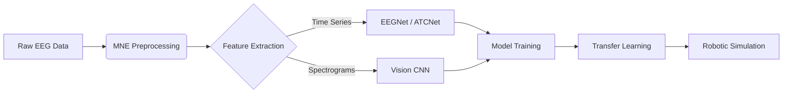

Here is a comprehensive, professional, and updated `README.md` file. It reflects the shift to **PyTorch**, the implementation of **Advanced Architectures (ATCNet/EEGNet)**, the addition of **Transfer Learning**, and the **Digital Twin Simulations**.

You can copy-paste this directly into your repository.

***

# Brain-Machine Interface (BCI) for Robotic Control 🧠➡️🤖

**A Deep Learning framework for decoding Motor Imagery (MI) EEG signals to control robotic systems.**

This project implements an end-to-end BCI pipeline: from raw signal processing and artifact removal to training state-of-the-art architectures (EEGNet, ATCNet) and validating them in a real-time digital twin simulation.

---

## 🚀 Key Features

*   **State-of-the-Art Architectures:** Implemented and benchmarked **EEGNet**, **ATCNet** (Attention Temporal Convolutional Network), and **Spectrogram CNNs** in **PyTorch**.
*   **Robust Preprocessing:** Automated pipeline using **MNE-Python** for filtering (4-40Hz), artifact removal (ICA for EOG/EMG), and signal standardization.
*   **Transfer Learning & Calibration:** A dedicated pipeline (`final_transfer_learning.py`) to fine-tune general models to specific users, boosting accuracy from **~75% (General)** to **>85% (Calibrated)**.
*   **Digital Twin Simulation:** A real-time visualizer using **Ursina Engine** and **PyBullet** to demonstrate robotic control (Rover/Arm) based on decoded brain states.
*   **Large-Scale Dataset:** Trained on the **PhysioNet EEG Motor Imagery Dataset** (109 Subjects).

---

## 🛠️ System Architecture



---

## 📂 Project Structure

```text
BMI-Robotic-Control/
├── Datasets/               # Raw and Processed EEG data
├── results/                # Saved models (.pth), logs, and figures
├── src/
│   ├── config.py           # Central configuration (Paths, Hyperparams)
│   ├── automated_cleaning.py   # ICA and Filtering Pipeline
│   ├── automated_validation.py # PSD and Variance Reports
│   ├── feature_engineering.py  # Spectrogram generation
│   ├── feature_engineering_eegnet.py # Raw Time-Series epoching
│   ├── train.py            # Main training loop (General Model)
│   ├── final_transfer_learning.py # User Calibration Script
│   ├── models/             # PyTorch Model Architectures
│   │   ├── eegnet.py
│   │   ├── atcnet.py
│   │   └── spectrogram_cnn.py
│   └── simulation_rover_final.py # Final Demo (Digital Twin)
├── requirements.txt
└── README.md
```

---

## ⚙️ Installation

### Prerequisites
*   **Python 3.10+**
*   **CUDA-capable GPU** (Highly Recommended for ATCNet training)

### Setup
1.  **Clone the repository:**
    ```bash
    git clone https://github.com/Littnatenate/BMI-Robotic-Control.git
    cd BMI-Robotic-Control
    ```

2.  **Create a Virtual Environment:**
    ```bash
    python -m venv .venv
    # Windows:
    .\.venv\Scripts\activate
    # Mac/Linux:
    source .venv/bin/activate
    ```

3.  **Install Dependencies:**
    ```bash
    pip install -r requirements.txt
    ```
    *Key Libraries: `torch`, `mne`, `numpy`, `scipy`, `ursina`, `wandb`, `scikit-learn`.*

---

## 🏃‍♂️ Usage Guide

The pipeline is designed to be run sequentially.

### 1. Preprocessing (Cleaning)
Clean raw EDF files using Bandpass filtering (4-40Hz) and Independent Component Analysis (ICA).
```bash
python src/automated_cleaning.py
```

### 2. Feature Extraction
Prepare the data for Deep Learning.
*   **For EEGNet/ATCNet (Time-Series):**
    ```bash
    python src/feature_engineering_eegnet.py
    ```
*   **For CNN (Spectrogram Images):**
    ```bash
    python src/feature_engineering.py
    ```

### 3. General Model Training
Train a "Subject-Independent" model on the dataset (e.g., 80 subjects).
```bash
python src/train.py
```
*Modify `src/train.py` to switch between `ATCNET_CONFIG`, `EEGNET_CONFIG`, etc.*

### 4. User Calibration (Transfer Learning)
Fine-tune the general model for a specific target subject (e.g., Subject 29) to achieve high-performance control.
```bash
python src/final_transfer_learning.py
```

### 5. Final Simulation (The Demo)
Launch the Digital Twin to visualize the BCI controlling a rover/robot based on the calibrated model.
```bash
python src/simulation_rover_final.py
```

---

## 📊 Model Architectures

| Model | Description | Input Shape | Best Use Case |
| :--- | :--- | :--- | :--- |
| **EEGNet** | Compact CNN with Depthwise Separable Convolutions. | `(1, 64, 320)` | **Real-time Control** (Fast & Efficient). |
| **ATCNet** | Hybrid architecture using **TCN** and **Multi-Head Attention**. | `(1, 64, 320)` | **Offline Analysis** (High Accuracy). |
| **Spectrogram CNN** | Standard 2D CNN treating EEG as images (Heatmaps). | `(64, 32, 40)` | **Baseline Comparison** (Computer Vision). |

---

## 📈 Results

*   **General Accuracy:** ~75.2% (EEGNet) on unseen subjects.
*   **Calibrated Accuracy:** **>85%** after fine-tuning on 50% of subject data.
*   **Inference Speed:** <10ms per trial on GPU.

---

## 📝 Acknowledgments

*   **Dataset:** [PhysioNet EEG Motor Movement/Imagery Dataset](https://physionet.org/content/eegmmidb/1.0.0/)
*   **Papers:**
    *   *EEGNet: A Compact Convolutional Neural Network for EEG-based Brain-Computer Interfaces (Lawhern et al., 2018)*
    *   *ATCNet: Attention Temporal Convolutional Network for EEG-based Motor Imagery Classification (Altaheri et al., 2022)*